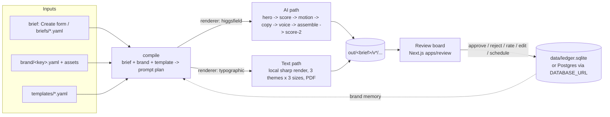

# Content Engine — Architecture

Last updated 2026-10-07. Read this first if you are picking the project up. Companion docs:
[CLAUDE.md](CLAUDE.md) (rules for AI agents), [README.md](README.md) (how to run it),
[SPEC.md](SPEC.md) (original handoff spec), [PLAN.md](PLAN.md) (vision and phases),
[DECISIONS.md](DECISIONS.md) (why things are the way they are).

## 1. Purpose

A **self-serve content engine for small and medium businesses**. A business adds its brand
once (logo, product photos, tone), picks a post type, types a few words, and gets finished,
on-brand, scored social posts it can download, approve and schedule.

The value is the engine around the generators, not the generators themselves: it decides
what to ask for, throws away off-brand output, assembles the deliverable in every size,
tracks cost, and learns from what the business approves.

**Current target clients (Oct 2026): SaaS companies selling AI products**, two kinds:

| | Product teams (have a tool to market) | Service teams (starting on social) |
|---|---|---|
| Lead with | Product Hero, UGC Reel, "ways to use it" carousel (need AI keys) | Quote Card, Insight Carousel, Tips List, Myth vs Fact (free, local) |
| Platforms | Instagram, LinkedIn | LinkedIn first (PDF carousel), then Instagram |

Facebook and X/Twitter are not platforms in the schema yet (`Platform` in
`packages/engine/src/schemas.ts` is `instagram | linkedin | youtube`); the 1:1 and 4:5
outputs post fine there by hand.

## 2. System at a glance

Two packages in a pnpm workspace (`pnpm-workspace.yaml`, `node-linker=hoisted`):

- **`packages/engine`** — TypeScript library + CLI scripts. No web server. Owns compile,
  rendering, scoring, the ledger.
- **`apps/review`** — Next.js 16 review board. Reads the engine's files directly and
  **spawns engine scripts as child processes** for anything that generates (create, run,
  brand wizard, batch). It does not import the engine package (DECISIONS #22), so the
  board stays free of sharp/provider SDKs.

## 3. Repo map

| Path | What it is |
|---|---|
| `packages/engine/src/schemas.ts` | Zod contracts for brand, brief, template, prompt plan, score card. Start here. |
| `packages/engine/src/config.ts` | `PATHS`, `REPO_ROOT` vs `DATA_ROOT`, `.env` loading |
| `packages/engine/src/load.ts` | YAML loaders, each validated against a schema |
| `packages/engine/src/compile.ts` | brief + brand + template -> `PromptPlan` (shots, aspects, copy seed, hashtags) |
| `packages/engine/src/pipeline.ts` | Runs the stages for one brief; `runTypographic` for text posts |
| `packages/engine/src/score.ts` | Deterministic hard checks first, then Claude vision rubric |
| `packages/engine/src/typographic.ts` | Text renderer core: themes, contrast, auto-fit text, quote card, bundled font |
| `packages/engine/src/slides.ts` | Insight carousel, tips card, comparison (myth vs fact) layouts |
| `packages/engine/src/layouts.ts` | Dispatcher for text layouts + deterministic score card |
| `packages/engine/src/outline.ts` | Parsers for the plain-text outlines (carousel, list, pairs) |
| `packages/engine/src/pdf.ts` | Minimal JPEG -> PDF writer for LinkedIn carousels |
| `packages/engine/src/palette.ts` | k-means palette extraction for the brand wizard |
| `packages/engine/src/intake.ts` | Brand intake: wizard answers (`IntakeSchema`) -> validated Brand (`brandFromIntake`) |
| `packages/engine/src/photo.ts` | Photo text posts: photo headline and stat card over a photo (or brand gradient) |
| `packages/engine/src/ideate.ts` | AI writer: drafts a post (type + every field) from notes, suggests ideas; Claude via the Anthropic SDK |
| `packages/engine/src/news.ts` | "What's new": web search (OpenRouter web plugin) for recent news in the brand's field, kept only if the URL came from the search, is recent and opens |
| `packages/engine/src/video.ts` | Local video editor on the bundled ffmpeg: segments, camera moves, brand cards and captions, fades, music/voice, 16:9 / 9:16 / 1:1 |
| `packages/engine/src/montage.ts` | Video posts: plans the edit (`planMontage`) and renders it (`runMontage`), draft (free) or full (Higgsfield) |
| `packages/engine/src/memory.ts` | Brand memory: the feedback loop from decisions into the next compile |
| `packages/engine/src/ledger.ts` | Cost + decision ledger on `node:sqlite` |
| `packages/engine/src/providers/` | Higgsfield (image/video), OpenRouter (Claude copy + vision), ElevenLabs (voice) |
| `scripts/create.ts` | Create one brief from the form and run it (text posts render immediately) |
| `scripts/run.ts` | Run briefs through the pipeline; `--dry-run` estimates credits with no calls |
| `scripts/create-brand.ts` | Brand wizard backend: reads the intake JSON, font family from uploaded fonts, palette (unless locked), writes `brand/<key>.yaml` |
| `scripts/draft.ts` | AI writer CLI (also behind `/api/draft`): one draft, or `--ideas` |
| `scripts/render-video.ts`, `scripts/export-video.ts` | Re-render a video post (draft / `--full` Higgsfield); turn a text post into short videos |
| `scripts/seed-mock.ts` | Demo data: renders real text posts, fakes photo/video posts + ledger rows. **Wipes `out/` and the ledger.** |
| `scripts/tripwire.mjs` | Malware tripwire (section 8) |
| `scripts/build-engine.mjs`, `scripts/vercel-prep.mjs` | Deploy-only: esbuild bundle of engine scripts, prep steps on Vercel |
| `apps/review/app/` | Pages: `/` board, `/brief/[id]`, `/create`, `/brand/new`, `/batch` (Fill my week), `/schedule`, `/report`, `/login` |
| `apps/review/app/api/` | Route handlers: create, brand, batch, rerun, repeat, decisions, caption, schedule, media, login, logout |
| `apps/review/lib/repo.ts` | Where the board finds the repo and the writable data dir; `engineArgs()` |
| `apps/review/lib/auth.ts`, `apps/review/proxy.ts` | Admin login (section 6) |
| `apps/review/lib/ledger.ts` | Board-side ledger: Postgres (Neon) when `DATABASE_URL` is set, else sqlite |
| `brand/` | Brand files + assets. `banjaaran` (fashion) and `brewcraft` (coffee) are sample brands |
| `templates/` | Post types (see section 4) |
| `prompts/`, `routing/routes.yaml` | Prompt templates; model ids and credit costs (no model id in code) |
| `briefs/` | 25 example briefs used by the demo seed |
| `assets/fonts/` | DejaVu Sans (free licence), loaded by file so text renders on hosts without fonts |

## 4. Post types (templates)

`templates/*.yaml`; `renderer` decides the path.

| Template | Renderer | Input | Output |
|---|---|---|---|
| `quote-card` | typographic | statement, optional credit line | 3 themes x 4:5 / 1:1 / 9:16 |
| `insight-carousel` | typographic | title + outline (`## Label \| Headline`, paragraphs, `- bullets`) | cover + pages + CTA page, PNG pages + LinkedIn PDF (4:5, 1:1; no 9:16) |
| `tips-list` | typographic | title + one tip per line (3–8) | one card, 3 sizes |
| `myth-vs-fact` | typographic | title + alternating `Myth:` / `Fact:` (any two labels) | two-column card, 3 sizes |
| `photo-headline` | typographic | headline (`*word*` = emphasis) + subline, photo or scene description | 3 treatments x 16:9 / 1:1 / 4:5 |
| `stat-card` | typographic | headline + `number \| label` line + panel text, photo or scene | big number over the photo, white panel with chat mock, 3 treatments x 16:9 / 1:1 / 4:5 |
| `product-hero` | higgsfield | product photo + hook | AI still (needs keys) |
| `carousel` | higgsfield | product photo + hook | AI slide set (needs keys) |
| `founder-story` | higgsfield | hook | LinkedIn image (needs keys) |
| `ugc-ad` | higgsfield | product photo + hook | short video + VO (needs keys) |
| `walkthrough` | montage | screenshots and/or screen recording + steps (`Step \| detail`, or `0:05-0:12 \| Step`) | product demo video, 16:9 / 9:16 / 1:1, 0 credits |
| `product-demo` | montage | product photos (or the brand's) + shots (`Caption \| camera move`) | cinematic product video; draft free, full = Higgsfield DoP |
| `cinematic-brand` | montage | scenes (`What the camera sees \| on-screen text`) | brand film; full = Higgsfield Soul + DoP |
| `presenter` | montage | presenter photo + script | talking presenter / UGC video; full = ElevenLabs voice + Higgsfield Speak |

To add a text layout: add the layout name to `TypographicLayout` in `schemas.ts`, render it
in `slides.ts`, dispatch it in `layouts.ts` (`renderPages`, `BODY_LAYOUTS`,
`validateLayoutInput`), add a parser in `outline.ts` if it takes an outline, add a
`templates/<name>.yaml`, a demo brief, and tests in `packages/engine/test/slides.test.ts`.

## 5. Rendering paths

### 5.1 AI path (photo/video, needs keys)

SPEC section 5 stages, one idempotent file per stage under `out/<brief>/`:
compile -> hero (Higgsfield Soul) -> score-1 (hard checks + Claude vision rubric, rank,
hide hard-fails) -> motion (Higgsfield DoP, video only) -> copy (Claude via OpenRouter) ->
voice (ElevenLabs, video only) -> assemble (crops, captions, ffmpeg) -> score-2.
Per-brief credit cap; every stage writes a ledger row. Without keys, `/create` compiles
the plan and the brief page shows "Not generated yet". `--dry-run` estimates credits.

Blockers to real generation are listed at the end of DECISIONS.md (keys, ffmpeg, model id
confirmation in `routing/routes.yaml`, public URL upload for image-to-video).

### 5.2 Text path (typographic, free, no keys)

Rendered locally with sharp (Pango text via `sharp({ text })`), 0 credits, seconds per post.

- **Themes:** dark, light, brand colour (from the brand palette). One theme per variant.
- **Sizes:** native layouts per aspect (4:5 1080x1350, 1:1 1080x1080, 9:16), not crops.
- **Auto-fit:** binary search on font size so text fills the space without overflowing.
- **Scoring is deterministic:** WCAG contrast (text >= 4.5:1, secondary >= 3:1) and fit.
  A page that can't fit gets a `legibility` hard fail ("too much text, shorten it").
- **Identity, not impersonation:** shows the brand's own name/handle/avatar
  (`social` + `font` in the brand file). Never draws verified badges or engagement counts.
- **Font:** bundled DejaVu Sans passed as `fontfile`, because serverless hosts have no
  system fonts (text rendered as a 148x12 sliver before this).
- **Outputs:** `out/<id>/v<n>/hero.png`, `final_4x5.jpg` etc., carousels also
  `pages_<aspect>/NN.jpg` and `carousel_<aspect>.pdf`.

### 5.2.1 Photo text posts (`photo.ts`)

`photo-headline` and `stat-card` are typographic layouts drawn over a photo, in the style of
LinkedIn "headline over a photo" posts. The photo, resolved once per post in
`resolvePhoto` (pipeline.ts): the uploaded photo -> a Higgsfield Soul image from the brief's
`scene` description (key set, within `credit_cap`, saved as `out/<id>/scene.png` and reused
for every theme and re-render) -> a brand photo -> none (brand gradient). The score card
says which ("photo: your upload", "brand photo — add HIGGSFIELD_API_KEY…").
Treatments per theme: dark = darkened photo + white type, light = white panel + ink type
(logo moves onto the photo), brand = photo tinted in the brand colour. `*word*` in the
headline is emphasised in the accent colour (stripped in board titles). Stat cards parse
`number | label` from the first body line (`parseStat`, number <= 12 chars).

### 5.2.2 AI writer (`ideate.ts`)

"Let AI write it" on Create: rough notes (or none) -> Claude picks the post type and writes
every field (hook with emphasis, body in that template's format, attribution, photo
scene, CTA, pillar) plus a one-line "why". "Give me ideas" returns post ideas spread
across pillars and formats; clicking one drafts it. The user reviews and edits, then
generates — nothing renders or spends without that click.

"What's new" (`newsIdeas` + `news.ts`) searches the web for the last 14 days of news in the
brand's field (built from category, offer, pillars, audience) and turns the stories that
matter to its audience into post ideas written as the brand's take. Trust rules: only URLs
the search returned, inside the window, that open. The chosen story travels as
`brief.source`; the caption names the publisher and ends with the link.

- **Model and API:** Claude via the official Anthropic SDK (`providers/anthropic.ts`),
  model and effort from `routes.yaml` `ideate` (`claude-opus-5-5`, `medium`), structured
  outputs (`output_config.format` json_schema; current models reject forced `tool_choice`),
  server-side refusal fallback (`fallbacks: "default"`, beta
  `server-side-fallback-2026-07-01`), refusals and truncation raise clear errors. Without
  `ANTHROPIC_API_KEY` it falls back to OpenRouter with `copy.model`; with neither, the
  panel says which key to add.
- **Facts:** the prompt allows only facts from the notes and the brand's proof points; no
  real number -> no stat post.
- **Format check:** each draft is validated against its template (outline parsers,
  montage planning for scripts/scenes) and retried once quoting the problem.
- **Templates offered:** every typographic and montage template (`writableTemplates`).
- Verified: unit tests with Claude mocked, and a browser run against a local mock of the
  Messages API (`ANTHROPIC_BASE_URL`) confirming the request (model, json_schema, effort,
  fallbacks, beta header, no tool_choice). Not yet run against the real API.

### 5.3 Video path (montage: real media + Higgsfield + local editor)

For enterprise demos, walkthroughs, launches and UGC-style ads. `planMontage` turns the
brief into shots; `runMontage` renders them with the local editor (`video.ts`) into
`out/<id>/v1/final_16x9.mp4`, `final_9x16.mp4`, `final_1x1.mp4` (+ `.jpg` posters),
`caption.txt`, `score.json`, and `out/<id>/montage.json` (mode, estimate, spent, shots).

- **Every video:** branded intro card (title + offer/angle), outro card (CTA + website or
  handle), on-brand captions (brand font, accent bar, kept clear of the bottom 20% on 9:16
  where app UI sits), corner logo, fades, optional music; a silent AAC track otherwise.
- **Two modes.** *Draft* (on Create, free, ~30–40 s for three sizes): AI shots are stood in
  by camera moves on the source photo, or a labelled card for scenes with no photo, so the
  edit and timing can be approved first. *Full* ("Render with Higgsfield" on the post page,
  or `render-video.ts --full`, or `run.ts` when a key is set): refuses without
  `HIGGSFIELD_API_KEY` or above the post's `credit_cap`, records every call in the ledger.
- **Higgsfield calls** (`providers/higgsfield.ts`, SDK 0.2.6): `uploadFile` (v1 client,
  `/files/generate-upload-url`, returns a public CDN URL — this also unblocked the old
  UGC hero -> DoP step), `listMotions` (live camera-preset list, cached a day in
  `data/higgsfield-motions.json`) + `pickMotion` (friendly name -> preset), `animate`
  (DoP `/v1/image2video/dop` with optional `motions`), `presenter` (Speak v2
  `/v1/speak/higgsfield`: image + WAV, 5/10/15 s), scenes via Soul text-to-image.
  Costs come from `routing/routes.yaml` (`video`, `image`, `speak`; still PLACEHOLDERS).
- **Voice:** in full mode, if `ELEVENLABS_API_KEY` and a voice (brand `voice_id` or
  `ELEVENLABS_VOICE_ID`) exist, captions are narrated and stills stretch to fit; presenter
  videos speak the script (MP3 -> WAV locally -> Speak), captions follow sentence by sentence.
- **AI can't show a client's real UI**, so walkthroughs always cut real screens; Higgsfield
  adds cinematic shots and presenters around them.
- **Text post -> video:** "Make a video (free)" on any text post (`export-video.ts`): carousel
  pages as a slideshow, single cards with a gentle push-in, 9:16 + 1:1 (`video_*.mp4`).
- **ffmpeg** is bundled (`@ffmpeg-installer/ffmpeg`, binaries from the npm registry, no
  download script; Linux runs `chmod` only). It is 4.1 (no `xfade`), so segments fade
  through the background. `FFMPEG_PATH` overrides. The old `assembleVideo` now uses it and
  draws captions as PNG overlays (it had a hard-coded Windows Arial path before).

Not yet verified against the live API (no keys yet): the exact DoP `motions` and Speak
`input_audio` request fields, preset names on the account, and real credit costs. The
mocked test (`test/montage.test.ts`) checks our side of the calls.

## 6. Review board

- **Board `/`**: brief cards, filter by brand (switcher in the sidebar).
- **Brief `/brief/[id]`**: ranked variants with score reasons, editable caption,
  approve / reject / rate / re-run with a plain-words note, downloads per size + PDF.
- **Create `/create`**: pick a post type, brand, words (and product image for AI types).
- **Add your brand `/brand/new`**: a 4-step intake (section 6.1).
- **Fill my week `/batch`**, **Schedule `/schedule`**, **Report `/report`** (cost,
  pass rate, human/engine agreement).
- **Media** is served from `out/` through `/api/media/[...path]`, never copied, with byte
  ranges (206) so videos seek and play in Safari.
- **Video posts:** players + MP4 downloads for each size, "Render with Higgsfield (~N
  credits)" (disabled with the reason when no key) and "Re-render draft"; `/api/video`
  runs `render-video.ts` / `export-video.ts`.

### 6.1 Brand intake (Add your brand)

Four steps in `BrandWizard.tsx`, posted as one `intake` JSON + files to `/api/brand`,
built into a brand by `brandFromIntake` (`packages/engine/src/intake.ts`). Every new brand
field is optional, so brand files made before the intake still load.

| Step | Asks | Stored as | Used by |
|---|---|---|---|
| 1 Business | name, product or service, one-line offer, products/services, website, proof points | `business_type`, `offer`, `products`, `website`, `proof_points` | copy prompts; service brands need no photos (offerings become products without images) |
| 2 Audience & goals | audience, category, pains, goals, channels (incl. Facebook, X), posts/week | `audience`, `category`, `pains`, `goals`, `channels`, `posts_per_week` | copy prompts |
| 3 Voice & content | tone, content pillars (suggested from type + goals), default CTA, banned words, liked examples, brand rules, disclaimer | `tone`, `pillars`, `default_cta`, `banned_words`, `examples`, `brand_rules`, `disclaimer` | copy prompts and outline drafts (`brandContext` in refine.ts); pillar chips on Create and hints in Fill my week; CTA when a post leaves it blank; disclaimer appended to every caption |
| 4 Look | logo, photos, handle, display name, colours (detect or exact), post themes, brand font files, credit budget | `logo`, `social`, `palette` (+ `palette_locked`), `themes`, `font` + `font_files`, `monthly_credit_budget` | text-post renderer |

**Enterprise brand kits:** "Use our exact colours" stores the hex values primary first and
sets `palette_locked`; they are never re-detected and the brand theme uses the primary as
its background. Uploaded `.ttf`/`.otf` files are saved under `brand/<key>/assets/`, the
family name is read from the font's name table (`fontFamilyName`), and the renderer loads
the file by path (`registerFont`), so it works on machines without the font installed.
`themes` limits text posts to the chosen themes; a text post makes one version per theme.

Not yet: editing a brand after creation (edit `brand/<key>.yaml` by hand), disclaimer
drawn on the image (caption only), WOFF fonts, Facebook/X as render targets (they are
`channels`, not `Platform`s).

### Admin login

One admin account, for demos. Not multi-tenant.

- `ADMIN_USERNAME` (default `admin`), `ADMIN_PASSWORD`, `AUTH_SECRET` (signs the cookie;
  falls back to the password). Env values are trimmed and unquoted; username is
  case-insensitive.
- Session cookie `ce_session` = `<expiry>.<HMAC>`, 7 days, httpOnly, sameSite lax, secure
  in production. Web Crypto only, so it runs in `proxy.ts` (Next 16's middleware).
- `proxy.ts` guards every page and API route except `/login` and `/api/login`: pages
  redirect to `/login?next=`, API routes get 401. `next` only accepts same-site paths.
- **Fails closed:** on Vercel without `ADMIN_PASSWORD`, every request is 503. Locally,
  login is off unless `ADMIN_PASSWORD` is set.
- Failed logins log the reason (never the values) to the server log.

## 7. Data and storage

`REPO_ROOT` holds config shipped with the code. `DATA_ROOT` holds everything the app
writes. They are the same directory locally; set `CONTENT_DATA_DIR` to split them.

| Data | Location | Notes |
|---|---|---|
| prompts, templates, routing, fonts | `REPO_ROOT` | read-only at run time |
| brands (`brand/`) | `DATA_ROOT` | the wizard writes here; seeded from the repo copy |
| briefs, uploads, `out/` | `DATA_ROOT` | generated |
| ledger | `DATA_ROOT/data/ledger.sqlite` | or Postgres (Neon) when `DATABASE_URL` is set (board side) |

`out/`, `data/`, `uploads/` and `*.sqlite` are gitignored. The board exports
`CONTENT_DATA_DIR` to the processes it spawns so both sides agree.

## 8. Deployment

### Local (the supported way to demo and use it today)

Node **22.5+** (the ledger uses `node:sqlite`), Git, pnpm 9.15.0. See README "Run it on
Windows" for the exact steps, including the corepack EPERM and PowerShell
execution-policy fixes. `pnpm seed` once, then `pnpm review` -> http://localhost:3000.
Everything works locally: brand wizard, all text posts, approvals, schedule, report.

### Vercel (demo viewing only)

Built and tested, but **not suitable for real use**. Vercel's filesystem is read-only, so
writes go to `/tmp` (`CONTENT_DATA_DIR=/tmp/content-engine`, seeded from the build). But
`/tmp` is **per function instance and wiped on cold start**, and requests are spread
across instances, so a brand or post created on one request can 404 on the next. Seeded
demo posts show reliably; anything created on the site may vanish.

Build: the review app's `build` script runs `scripts/vercel-prep.mjs` (tripwire -> esbuild
bundle of engine scripts to `apps/review/.engine/` -> demo seed) before `next build`, so
it works whether the Vercel Root Directory is the repo root or `apps/review`.
`next.config.mjs` `outputFileTracingIncludes` ships config, demo data, fonts, the bundle
and sharp's linux-x64 binaries (~61 MB). Env: `ADMIN_PASSWORD`, `AUTH_SECRET`, optional
`ADMIN_USERNAME`, optional `DATABASE_URL`.

### What a real hosted version needs (Phase 3)

Either one long-running server with a persistent disk (Render, Railway, Fly) — works with
the current code — or, for serverless, object storage for `brand/`, uploads and `out/`
(e.g. Vercel Blob / S3) plus Postgres for briefs and the ledger, and a job queue instead of
spawning child processes inside requests. Then real auth and tenants.

## 9. Security

- **Incident:** commit `571b629` (2026-09-20) was injected by malware on the developer's
  machine (the "PolinRider" pattern): an obfuscated payload after hundreds of spaces at the
  end of `apps/review/postcss.config.mjs`, a `global.i = '…'` style marker, and `.gitignore`
  lines hiding its `temp_auto_push.bat` / `temp_interactive_push.bat` /
  `branch_structure.json` helpers. Merged to main in `8e93b22`, removed in `b3f9dca`.
  **Never check out or run `571b629` or `8e93b22`.** Current files are clean (full scan
  2026-10-02: tripwire, marker grep, hidden files, lockfile sources, install scripts, CI).
- **History rewrite to drop those commits is PAUSED** by the owner because a client uses
  `main`. Do not rewrite or force-push `main` without explicit owner approval.
- **Tripwire** (`scripts/tripwire.mjs`) runs on every push/PR (GitHub Actions), in every
  Vercel build, and as a pre-commit hook (`git config core.hooksPath .githooks`). It flags
  very long or whitespace-padded lines, obfuscation patterns in config/.mjs files, tracked
  scripts/executables, the malware helper names in `.gitignore`, install scripts in any
  `package.json`, and non-npm tarballs in lockfiles. Run it before `pnpm install` on a
  fresh clone.
- **Secrets** live in `.env` (gitignored) or the host's env settings. Never commit them.

## 10. Testing

- `pnpm test` — vitest, engine unit tests (74 as of 2026-10-07): compile, scoring, ledger,
  memory, palette, typographic renderer, slides/outlines/PDF, intake, montage planning,
  a mocked full Higgsfield render, photo posts, and the AI writer (Claude mocked).
- **AI features without a key:** point `ANTHROPIC_BASE_URL` at a local mock of
  `POST /v1/messages` to exercise the real SDK request end to end.
- `pnpm typecheck` (root) has 1 known pre-existing error (pipeline Soul resolution type). `apps/review` typecheck is clean.
- **Before handing a change to the owner, click through it in a real browser** on a fresh
  clone (Playwright with the preinstalled Chromium works): every nav page, every seeded
  brief, the brand wizard, each text template for the new brand, approve. Lesson from
  2026-10-01: single-server rehearsals missed Vercel's multi-instance `/tmp` problem.
- **Videos in the test browser:** Playwright's Chromium has no H.264, so MP4s won't play
  there (`canPlayType` returns ""). Verify MP4s with ffmpeg (h264, yuv420p, `moov` before
  `mdat`) and check the player path with a VP9 `.webm` copy; real Chrome/Edge/Safari play them.

## 11. Known gaps

- Real AI generation not yet run (no keys); model ids, Higgsfield request fields for
  motions/Speak and credit costs in `routing/routes.yaml` unconfirmed.
- Video renders run inside the request (30 s–several minutes); a job queue is needed for
  hosting. Video isn't supported on the Vercel demo (no ffmpeg traced, function time limits).
- Facebook and X/Twitter not in the platform list.
- Single admin login, no tenants, no per-client data isolation.
- Hosted storage (section 8) not built; Vercel is view-only for demos.
- No publishing to platforms; Schedule is a plan, not a poster.
- Sample brands and briefs are placeholders, not a real client's.
